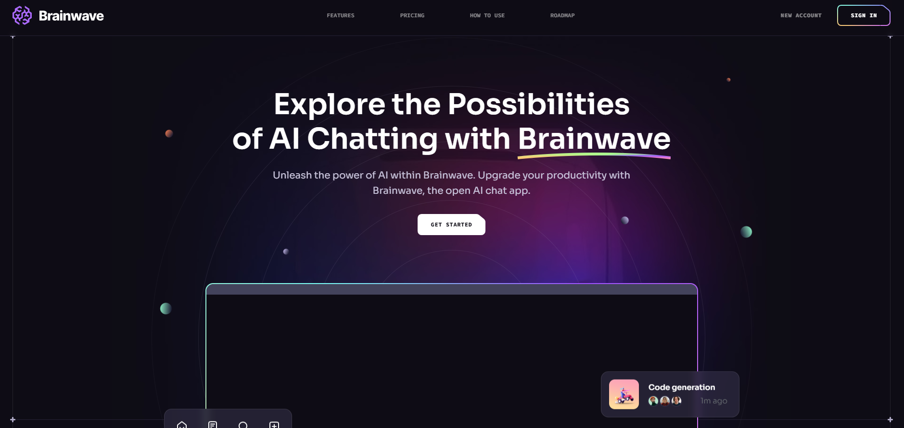

<div>
  
  
  
</div>

<h3 align="center">Modern UI/UX Developer Portfolio Website</h3>



Deployed Link: https://brainwaveprojectt.netlify.app/

<div align="center">
  This portfolio showcases my skills, projects, and development journey using React.js, Tailwind CSS, and Vite. Built with performance and smooth UI in mind, inspired by modern design trends.
</div>


## <a name="introduction">🤖 Introduction</a>

Brainwave - Modern UI/UX website, developed using React.js and Tailwind CSS, exemplifies modern UI/UX principles. Its sleek design, seamless animations, and overall user experience set a high standard, serving as a reference or inspiration for future modern applications or websites in general.


## <a name="tech-stack">⚙️ Tech Stack</a>

* Vite
* React.js
* Tailwind CSS

## <a name="features">🔋 Features</a>

👉 **Beautiful Sections**: Includes hero, about, projects, skills, contact, and footer.

👉 **Parallax Animations**: Engaging effects triggered by mouse movement and scrolling.

👉 **Complex UI Geometry**: Utilizes Tailwind CSS for intricate visual shapes, grid lines, and smooth transitions.

👉 **Latest UI Trends**: Implements modern design elements such as bento grid layouts.

👉 **Cool Gradients**: Uses stylish gradients across components, cards, and buttons for enhanced visuals.

👉 **Responsive Design**: Works seamlessly on desktops, tablets, and mobile devices.

👉 **Code Reusability**: Structured for scalability with reusable components and clean architecture.

## <a name="quick-start">🤸 Quick Start</a>

Follow these steps to set up the project locally on your machine.

**Prerequisites**

Make sure you have the following installed on your machine:

* [Git](https://git-scm.com/)
* [Node.js](https://nodejs.org/en)
* [npm](https://www.npmjs.com/)

**Cloning the Repository**

```bash
git clone https://github.com/Shivam20202/Ai-Platform.git
cd portfolio-site
```

**Installation**

```bash
npm install
```

**Running the Project**

```bash
npm run dev
```

Open [http://localhost:5173](http://localhost:5173) to view the portfolio in your browser.

